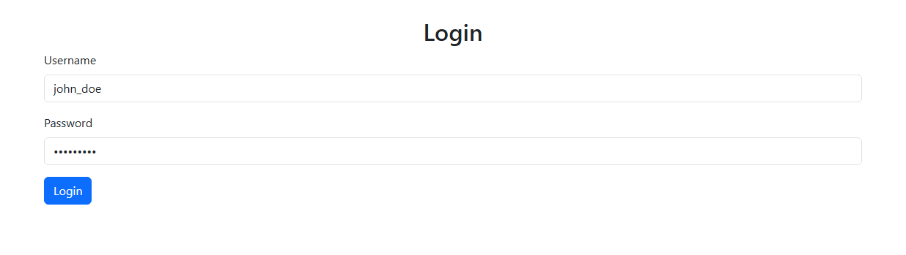
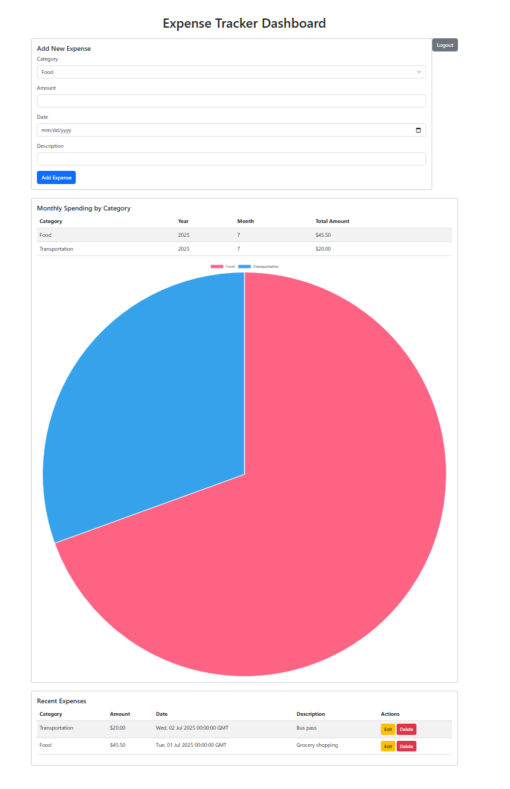

# Expense Tracker Dashboard

A full-stack web application for managing personal expenses, featuring secure user authentication, dynamic data visualizations, and PostgreSQL integration. This project highlights SQL proficiency through advanced queries and aggregations, paired with a Flask backend and Bootstrap-based frontend enhanced with Chart.js.

---

## 🔗 Live Demo

👉 [View the Deployed App on Render](https://sql-expense-tracker.onrender.com/login)  
*(Use the sample login credentials below. The Render free tier may take 30–60 seconds to spin up after inactivity.)*

---

## 🚀 Features

- **CRUD Operations**: Add, edit, and delete expenses (date, amount, category, and description).
- **Dashboard Visuals**: Monthly spending breakdowns by category shown in both a table and an interactive pie chart (via Chart.js).
- **Recent Expenses**: View latest entries with inline edit and delete buttons.
- **Authentication**: Secure user login/logout (Flask-Login + Bcrypt hashing); users only see their own data.
- **SQL Highlights**: Advanced queries using `JOIN`, `GROUP BY`, and `EXTRACT`, with parameterized statements to protect against SQL injection.

---

## 🛠 Tech Stack

| Component  | Technologies |
|------------|--------------|
| **Database** | PostgreSQL (schema design, aggregations, CRUD operations) |
| **Backend** | Python, Flask, Flask-Login, Flask-Bcrypt, Gunicorn |
| **Frontend** | HTML, CSS, JavaScript, Bootstrap (responsive UI), Chart.js |
| **Tools** | python-dotenv (env vars), psycopg2 (DB connector) |

---

## ✅ Prerequisites

- Python 3.8+
- PostgreSQL installed and running (with `psql` CLI)
- Git installed

---

## ⚙️ Local Setup Instructions

### 1. Clone the Repository
```bash
git clone https://github.com/Jossell-Araiza/SQL-Expense-Tracker.git
cd SQL-Expense-Tracker
```

### 2. Set Up Virtual Environment
```bash
python -m venv venv
.\venv\Scripts\activate  # On Windows
# OR
source venv/bin/activate  # On macOS/Linux

pip install -r requirements.txt
```

### 3. Set Up PostgreSQL Database

Create a new database and user:
```sql
psql -U postgres
CREATE USER expense_user WITH PASSWORD 'your_password';
CREATE DATABASE expense_tracker;
GRANT ALL PRIVILEGES ON DATABASE expense_tracker TO expense_user;
\q
```

Seed the database:
```bash
psql -U expense_user -d expense_tracker -f expense_tracker.sql
```

### 4. Configure Environment Variables

Create a `.env` file in the root directory:
```env
DB_USER=expense_user
DB_PASSWORD=your_password
DB_NAME=expense_tracker
DB_HOST=localhost
DB_PORT=5432
```

### 5. Run the Application
```bash
python app.py
```

Open `http://localhost:5000` in your browser. You’ll be redirected to the login page.

---

## 👤 Sample Login Credentials

These demo accounts are preloaded in the database:

| Username    | Password   |
|-------------|------------|
| john_doe    | password1  |
| jane_smith  | password2  |

> 🔒 Passwords are securely hashed using Bcrypt.

---

## 🧑‍💻 Usage

1. Log in with the sample credentials above.
2. Add expenses using the form (date, amount, category, description).
3. View the live dashboard with:
   - A monthly breakdown table
   - A category-based pie chart
4. Use inline edit/delete buttons to manage expenses.
5. Click "Logout" to end your session.

---

## 🖼 Screenshots

### 🔐 Login Page


### 📊 Dashboard View


---

## ☁️ Deployment

This app is deployed and hosted on [Render.com](https://render.com):

- **Backend**: Flask application served via Gunicorn
- **Database**: PostgreSQL hosted by Render, seeded with demo data
- **Configuration**:
  - Environment variables set securely in Render dashboard
  - Auto-deploys on GitHub commits to `main` branch

To try the live version:
1. Visit: [https://sql-expense-tracker.onrender.com/login](https://sql-expense-tracker.onrender.com/login)
2. Use sample credentials
3. Explore full functionality

---

## 📄 License

This project is licensed under the MIT License. See the [LICENSE](LICENSE) file for details.

---

## 👨‍💻 Author

Developed by **Jossell Araiza** on July 12, 2025  
[GitHub](https://github.com/Jossell-Araiza) • [LinkedIn](https://www.linkedin.com/in/jossell-araiza/)